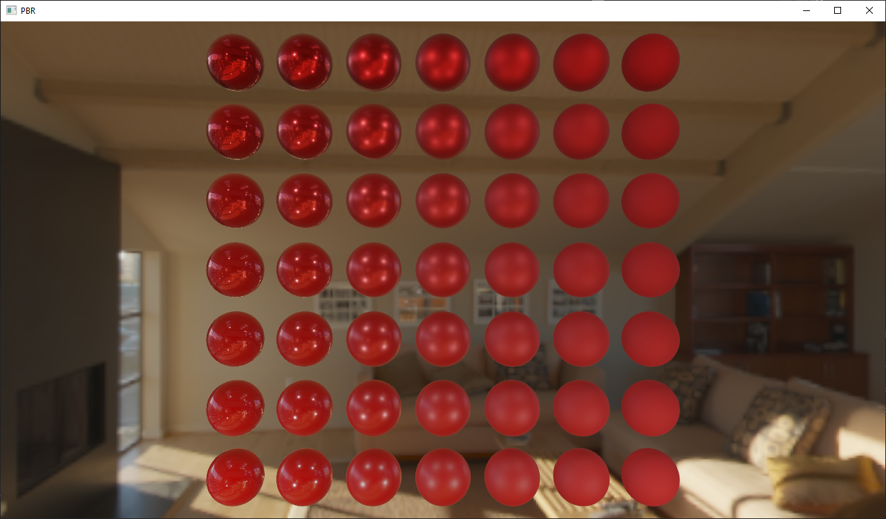
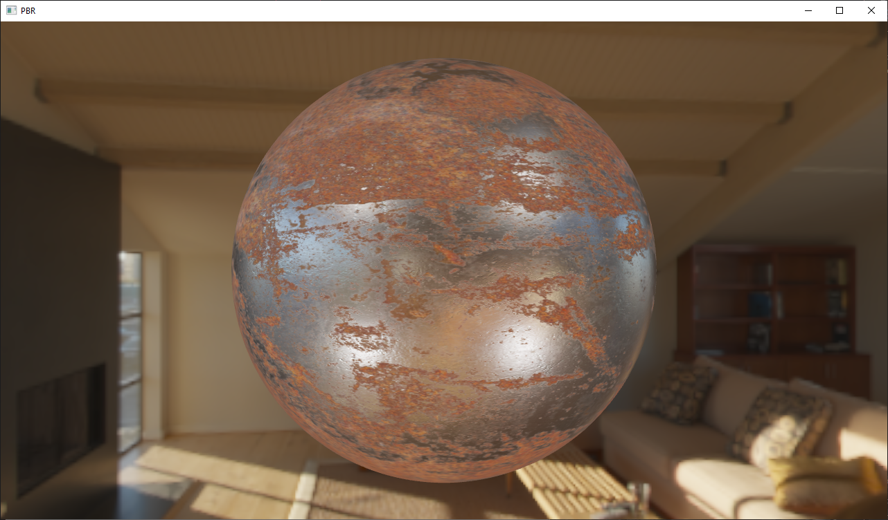
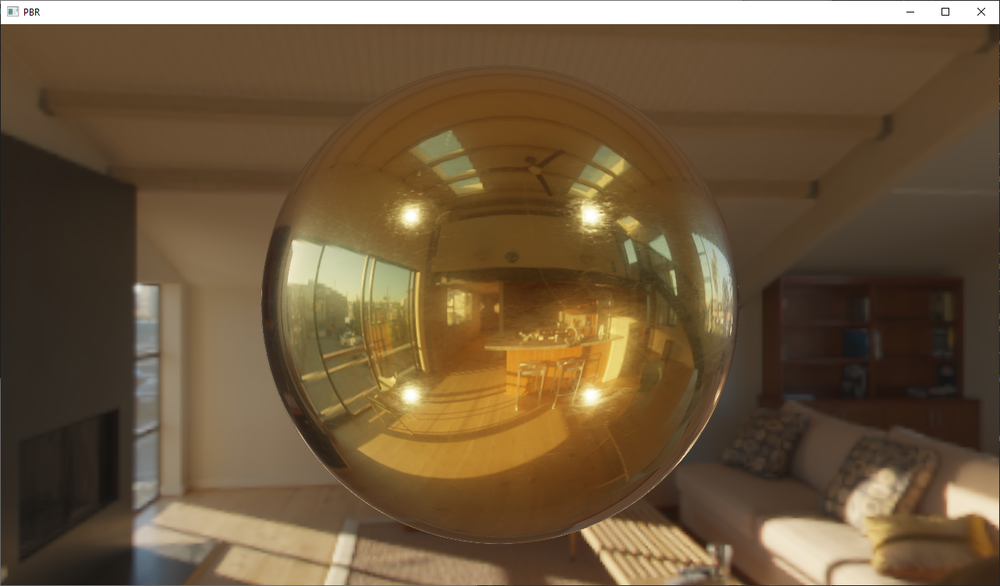
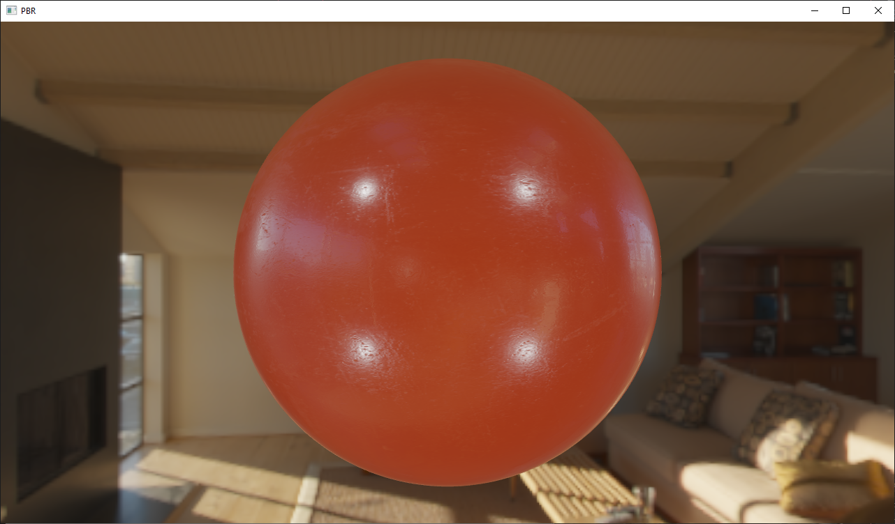

# Physically Based Rendering (PBR)

Creating a realistic physics-based renderer to simulate light and materials more in line with the real world, in OpenGL.

These studies are following the guidelines presented on the book [LearnOpenGL](https://learnopengl.com/PBR/Theory).

## Results

*1. Changing the metallic and roughness properties of the materials.*

*2. Using maps (textures) to acquire the material properties.*

*3. Changing the metallic and roughness properties of the materials, using maps to capture the environment lighting (IBL).*

### ...for some materials

*Rusted iron.*

*Gold.*

*Plastic.*

## Notes

The intention of this repository is to register the progress of the studies over the PBR, using OpenGL. For now, just a small taste towards the comprehension of this theme, but with nice results...
