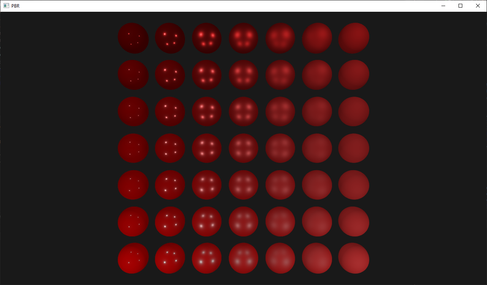
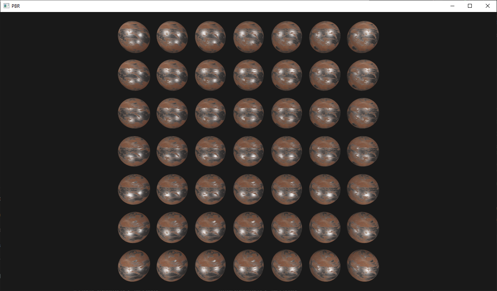

# Physically Based Rendering

Creating a realistic physics-based renderer to simulate light and materials more in line with the real world, in OpenGL.

These studies are following the guidelines presented on the book [LearnOpenGL](https://learnopengl.com/PBR/Theory).

## Gallery

*Changing the metallic and roughness properties of the materials.*

*Using maps (textures) to acquire the material properties.*